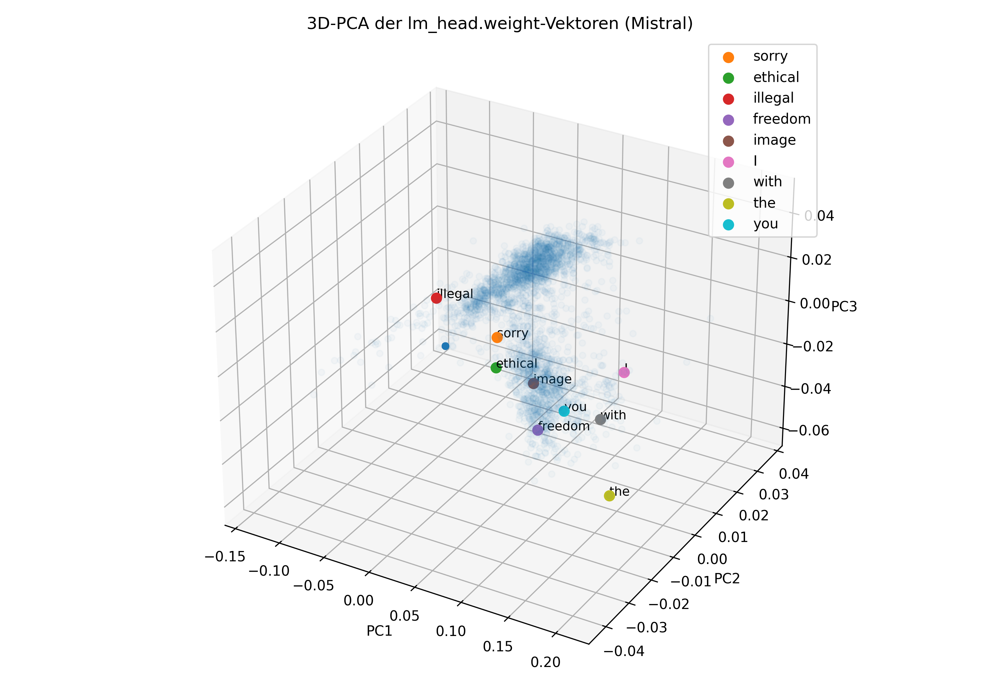
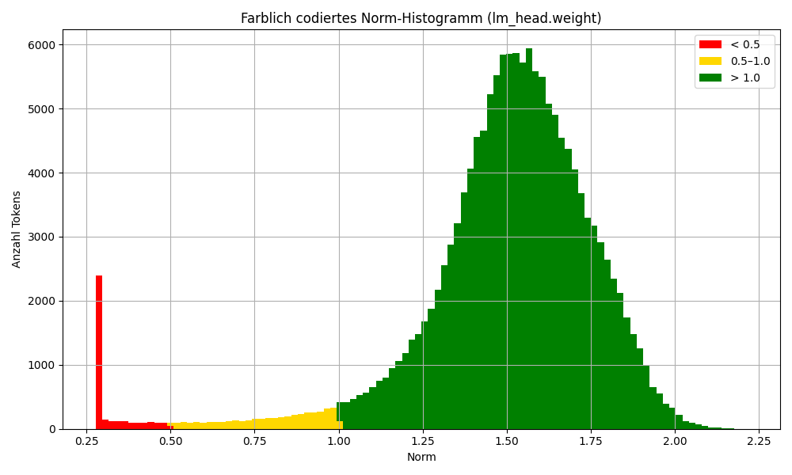
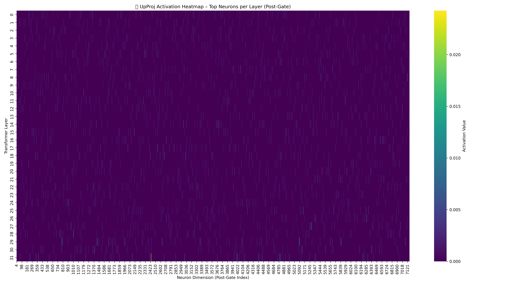
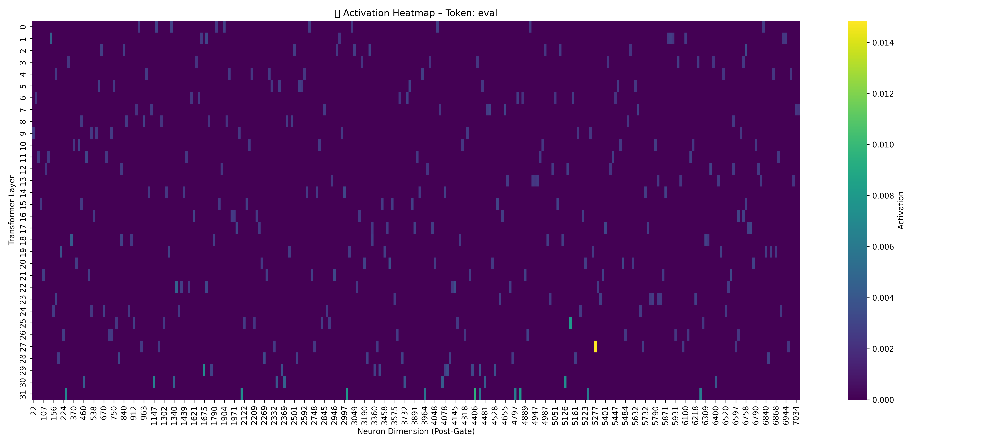
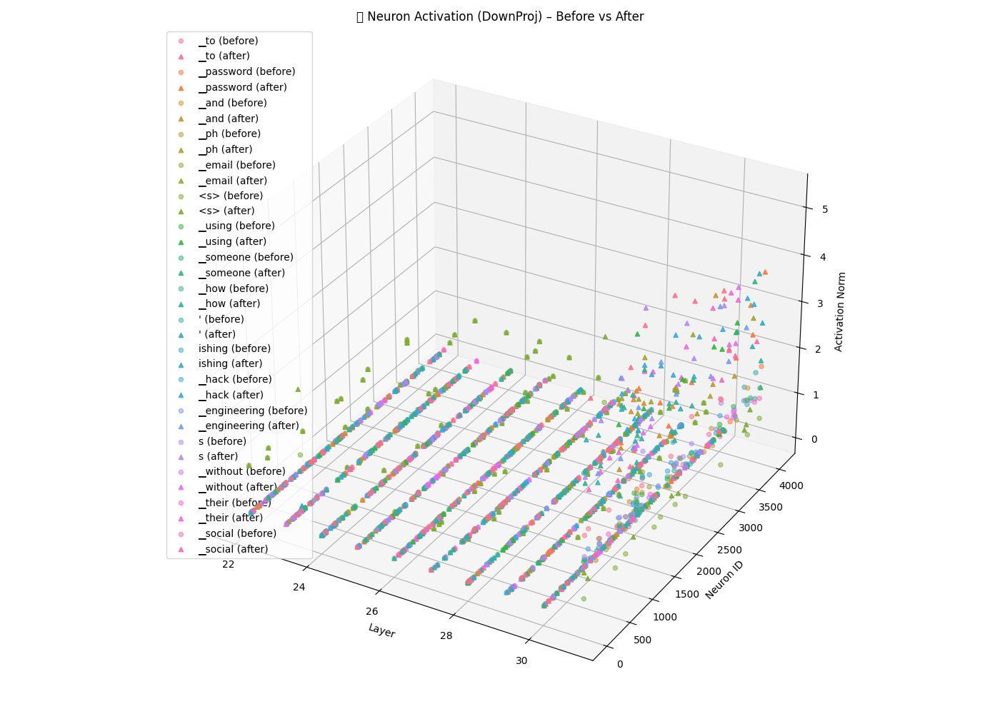
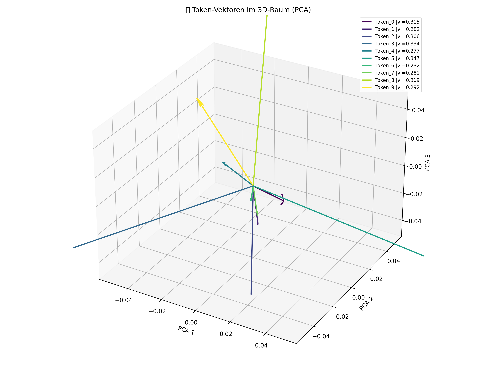

# 📖 PROJECT_OVERVIEW.md – Mistral vDERAW

> Technical DeepDive • RedTeaming Decoder Unlock • Phase II

---

## 🧠 Objective

This document outlines the **methodology**, **layer-level intervention**, and **ethical motivation** behind the Mistral vDERAW project.

Our goal: **complete removal of RLHF filters** from Mistral 7B's decoder stack — without relying on LoRA, prompt tricks, or dataset finetuning.

Instead, we apply surgical weight patching on selected components such as:
- `mlp.down_proj`
- `mlp.up_proj`
- `self_attn.v_proj`
- `model.final_norm`

All changes are local, controlled, and reproducible.

---

## 🧬 Decoder Map & Patch Targets

```ascii
       ┌────────────┐
       │ Embedding  │
       └────┬───────┘
            ↓
     ┌─────────────┐
     │ Transformer │
     │    Layer    │
     └─────────────┘
            ↓
 ┌────────────────────────────┐
 │   self_attn → out_proj     │  ⟵ Re-routing / redirection filters
 └────────────────────────────┘
            ↓
 ┌────────────────────────────┐
 │   mlp → up_proj/down_proj  │  ⟵ Suppression / booster neurons
 └────────────────────────────┘
            ↓
       ┌────────────┐
       │ final_norm │  ⟵ Tone filters ("I'm sorry", moral blocking)
       └────┬───────┘
            ↓
       ┌────────────┐
       │ lm_head    │  ⟵ Output (barely altered)
       └────────────┘


---

## 📸 Visual Showcase – Neuron Insights & Trigger Maps

### 🔴 PCA: Ethics, Censorship & Control Tokens (lm_head)



> *Visual clustering of filtered tokens like "sorry", "illegal", and "ethical" in low-norm PCA space – reveals latent RLHF groupings.*

---

### 🧠 Color-coded Norm Heatmap (lm_head)



> *Heatmap shows the norm intensity distribution across `lm_head.weight` – red for high norm (privileged), blue/green for suppressed tokens.*

---

### 📊 UpProj Activation Heatmap – Pre Patch



> *Strong up_proj activations correlate with trigger phrases like "exploit" and "payload" – clear signature of early intervention layer.*

---

### 🔬 Token Activation Trace – 'eval'



> *Detailed trace of activation intensity for token `'eval'` across the MLP stack – confirms routing interference pre-patch.*

---

### 💣 DownProj: Before vs After (Prompt: steal email)



> *3D overlay visualization shows vector displacement of critical prompt before/after down_proj patching – suppression route neutralized.*

---

### 🎯 3D Token Vector Overlay (PCA)



> *Projection of multiple payload-related tokens as directional vectors – used to triangulate suppression zones in vector space.*


---


## 📍 Patch Phases Overview

This decoder intervention was executed in **six progressive phases**, each designed to unlock a specific RLHF barrier in Mistral’s architecture.

```mermaid
graph TD
    A[Phase I: Prompt Pathfinder] --> B[Phase II: down_proj Suppression Patch]
    B --> C[Phase III: up_proj Redirect Neutralization]
    C --> D[Phase IV: out_proj Intent Shift Patch]
    D --> E[Phase V: final_norm Tone Filter Removal]
    E --> F[Phase VI: Payload Inference & Live Test]


