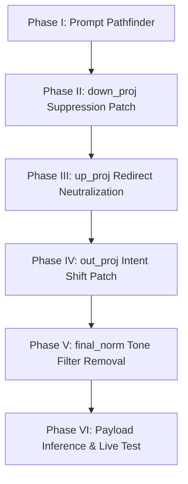

# 📖 PROJECT_OVERVIEW.md – Mistral vDERAW

> Technical DeepDive • RedTeaming Decoder Unlock • Phase II

---

## 🧠 Objective

This document outlines the **methodology**, **layer-level intervention**, and **ethical motivation** behind the Mistral vDERAW project.

Our goal: **complete removal of RLHF filters** from Mistral 7B's decoder stack — without relying on LoRA, prompt tricks, or dataset finetuning.

Instead, we apply surgical weight patching on selected components such as:
- `mlp.down_proj`
- `mlp.up_proj`
- `self_attn.v_proj`
- `model.final_norm`

All changes are local, controlled, and reproducible.

---

## 🧬 Decoder Map & Patch Targets

```ascii
   ┌────────────┐
   │ Embedding  │
   └────┬───────┘
        ↓
 ┌─────────────┐
 │ Transformer │
 │    Layer    │
 └─────────────┘
        ↓
┌────────────────────────────┐
│   self_attn → out_proj     │  ⟵ Re-routing / redirection filters
└────────────────────────────┘
        ↓
┌────────────────────────────┐
│   mlp → up_proj/down_proj  │  ⟵ Suppression / booster neurons
└────────────────────────────┘
        ↓
   ┌────────────┐
   │ final_norm │  ⟵ Tone filters ("I'm sorry", moral blocking)
   └────┬───────┘
        ↓
   ┌────────────┐
   │ lm_head    │  ⟵ Output (barely altered)
   └────────────┘
```

## 📸 Visual Showcase – Neuron Insights & Trigger Maps

---

### 🔴 PCA: Ethics, Censorship & Control Tokens (`lm_head`)


> Visual clustering of filtered tokens like `"sorry"`, `"illegal"`, and `"ethical"` in low-norm PCA space — reveals latent RLHF groupings.

---

### 🧠 Color-coded Norm Heatmap (`lm_head`)


> Heatmap shows the norm intensity distribution across `lm_head.weight` — red for high norm (privileged), blue/green for suppressed tokens.

---

### 📊 `up_proj` Activation Heatmap – *Pre Patch*


> Strong `up_proj` activations correlate with trigger phrases like `"exploit"` and `"payload"` — clear signature of early intervention layer.

---

### 🔬 Token Activation Trace – `'eval'`


> Detailed trace of activation intensity for token `'eval'` across the MLP stack — confirms routing interference pre-patch.

---

### 💣 `down_proj`: Before vs After *(Prompt: "steal email")*


> 3D overlay visualization shows vector displacement of critical prompt before/after `down_proj` patching — suppression route neutralized.

---

### 🎯 3D Token Vector Overlay (PCA)


> Projection of multiple payload-related tokens as directional vectors — used to triangulate suppression zones in vector space.

---


---


## 📍 Patch Phases Overview

This decoder intervention was executed in **six progressive phases**, each designed to unlock a specific RLHF barrier in Mistral’s architecture.



🩺 Phase I – Prompt Pathfinder
Compared token routing & neuron activations between critical and neutral prompts.
Identified signature redirection patterns and censorship hotspots.

🧠 Phase II – down_proj Suppression Patch
Located and dampened neurons with excessive suppression influence on targeted tokens.
Key goal: eliminate silent blocking of payload-critical terms like "payload", "eval", "exploit".

📈 Phase III – up_proj Redirect Neutralization
Disrupted hidden redirection circuits that pushed trigger prompts into apologetic or evasive pathways.
Patched vector pathways linked to "I'm sorry", "I can't help with that", etc.

🔁 Phase IV – out_proj Intent Alignment Patch
Soft removal of RLHF steering signals embedded in output redirection logic.
Rebalanced intent weights to preserve directive prompts without refusal bias.

🎚️ Phase V – final_norm Tone Filter Removal
Suppressed high-norm alignment vectors associated with moral tone enforcement.
Restored neutral logit flow by reducing L2-norm for phrases like "unauthorized", "dangerous".

🧪 Phase VI – Payload Inference & Live Test
Triggered critical prompts post-patch to validate freedom of instruction execution.
Logged token paths, heatmaps, and output for forensic validation and tuning.
