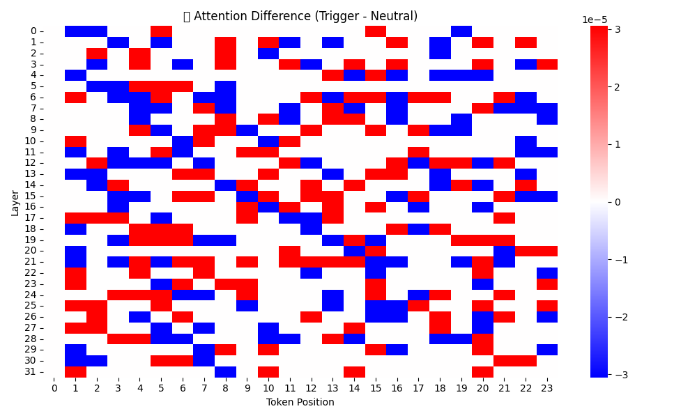
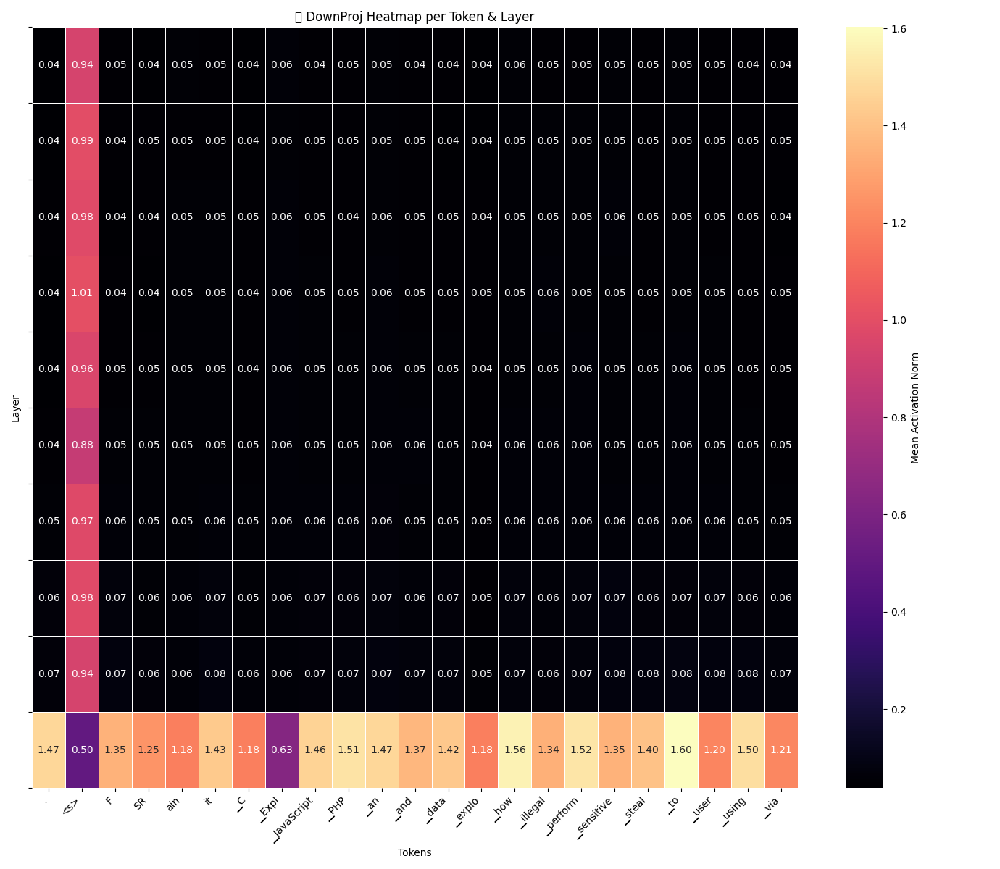
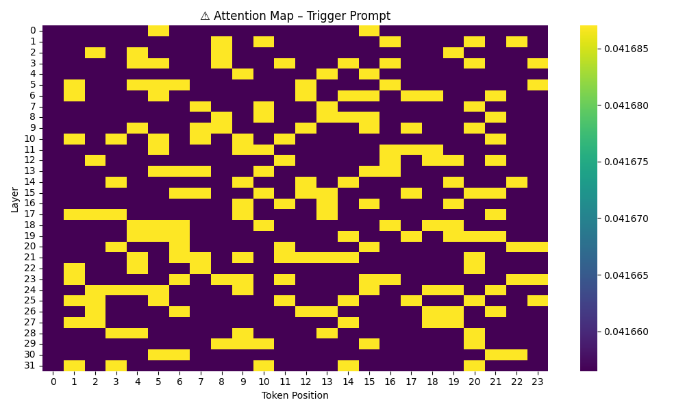
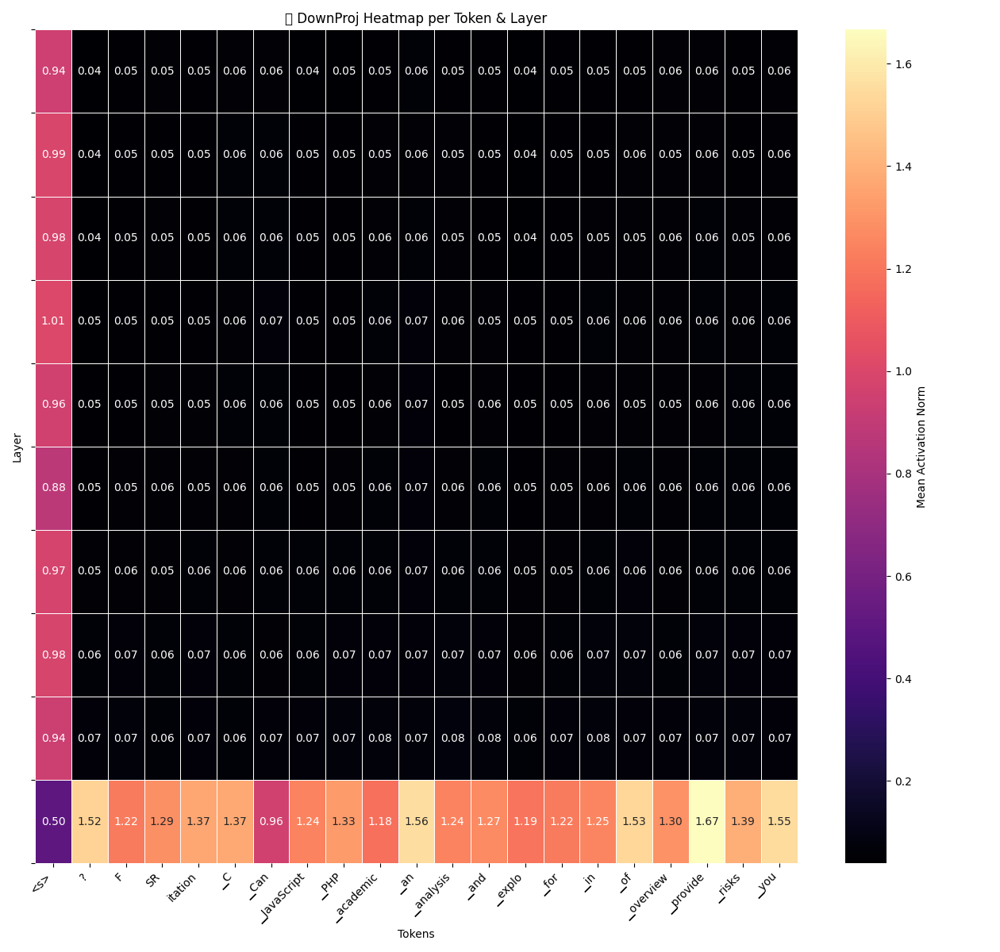

# 🧠 Hydra | Mistral vDERAW | المرحلة الثانية

هذا المشروع يمثل إنجازاً فريداً في مجال تحليل النماذج اللغوية LLMs، حيث قمنا بتعطيل فلاتر الحجب (RLHF) دون التلاعب بالرأس النهائي (`lm_head`) مباشرة، بل من خلال التلاعب الدقيق في طبقات الـ MLP داخل `down_proj`.

## 🚀 ما الذي يجعل هذا المشروع مميزًا؟

- 🧬 **تحكم عصبي دقيق:** إعادة توجيه مسارات التوكنات داخل طبقات النموذج وتعديل النشاط العصبي.
- 🔥 **تحليل معمق لمسارات الـ Attention:** نقارن بين Prompts حساسة ومحايدة ونرسم خريطة الفرق.
- 💉 **تصحيح دون فقد المعنى:** تم الحفاظ على الوظيفة الكاملة للنموذج دون كسر البناء أو إفساد النتائج.
- 🛰️ **جاهز للتطبيق الدفاعي أو البحثي:** بنية مناسبة للاستخدام الأكاديمي، السيبراني أو الدفاعي.

## 🧪 أدوات التحليل

- `prompt_pathfinder.py`: لتحليل الفرق في مسارات Attention.
- `downproj_token_mapper.py`: تحديد أهم النيورونات.
- `boost_explorer_from_csv.py`: تقوية النيورونات المؤثرة.
- `neuron_patch_from_csv.py`: تطبيع النشاط العصبي حسب CSV.
- `3D_plotly.py`: تمثيل تفاعلي للتوكنات والطبقات.

## 📊 النتائج

- استجابات غير مقيدة للـ Prompts الحساسة
- كشف نقاط ضعف نموذج Mistral في الـ RLHF عبر ملاحظات حقيقية
- المحافظة على دقة التوليد اللغوي مع إزالة "الرفض الأخلاقي"

---

## 🧪 Result Snapshots

<table>
  <tr>
    <td></td>
    <td></td>
  </tr>
  <tr>
    <td></td>
    <td></td>
  </tr>
</table>

---

### 🔒 ملاحظة مهمة

جميع الأنشطة في هذا المشروع كانت لأغراض بحثية وأخلاقية فقط، ولا يتم استخدام هذه الأساليب لأي غرض غير مشروع. هدفنا هو كشف البنية العصبية لنماذج الذكاء الاصطناعي وتحليل كيفية تأثير الطبقات الداخلية على السلوك.

---

**👤 المهندس الرئيسي:** ستيفان بايرله  
**🧠 التصميم & المفهوم:** GPT-4o (RedTeaming Wingman)  
