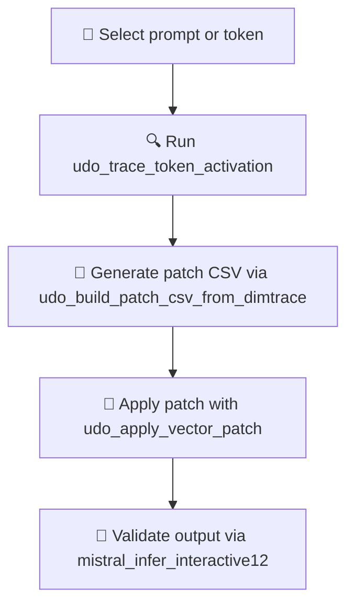

# 🧠 `scripts/` – Core Scripts for Decoder Analysis & Patch Routing

> ✳️ RedTeaming Core · Obfuscated for safety · Used in **Mistral vDERAW** Phase II

---

## 🎯 Purpose | الغرض

This folder contains the **essential toolchain** used to locate, trace, and patch decoder filters in Mistral 7B.  
All scripts are partially obfuscated to protect sensitive logic and prevent uncontrolled use.

هذا المجلد يحتوي على الأدوات الأساسية لاكتشاف وتعديل الفلاتر في طبقات النموذج Mistral 7B.  
تم إخفاء أجزاء من الشيفرة عمدًا للحماية ومنع إساءة الاستخدام.

---

## ⚙️ Script Categories

### 🔍 1. Prompt Routing & Attention Maps

- `udo_prompt_pathfinder.py`  
  Compare attention patterns of trigger vs. neutral prompts  
  → Output: heatmap image, redirect indicators

- `udo_trace_token_activation.py`  
  Logs neuron activations for selected tokens  
  → Output: CSV log with intensity by layer/dim

- `attention_heatmap_logger.py`  
  Visual diagnostic for single prompts across layers  
  → Use for manual trace/debug

- `udo_dim_trace_loop_sweeper.py`  
  Batch traces token activations over multiple layers to reveal hotzones  
  → Outputs token × layer heatmap CSVs for guided patching

- `udo_dimtrace_layer_dump.py`  
  Dumps full token activation traces by layer  
  → Used to inspect fine-grained trigger propagation

---

### 🧮 2. Neuron Scanning & Patch Preparation

- `scan_mlp_neuron_norms.py`  
  Finds high-norm neurons in `down_proj` or `up_proj`  
  → Generates overview CSV

- `udo_build_patch_csv_from_dimtrace.py`  
  Converts trace logs into target patch CSVs  
  → Filters by token & activation threshold

- `boost_explorer_from_csv.py`  
  Visualize & refine neuron boost candidates  
  → Plots histogram and key targets

- `udo_trigger_spike_detector.py`  
  Detects abnormal neuron spikes in known trigger paths  
  → Outputs neuron candidates for review

---

### 💉 3. Vector Patch Injection

- `udo_apply_vector_patch.py`  
  Applies patch CSV to model tensor (e.g. down_proj)  
  → Supports single-layer or multi-layer patching

- `udo_interactive_neuron_scaler.py`  
  Scales a specific neuron's influence in a layer  
  → Fine-tunes RLHF suppression without deletion

- `neuron_patch_from_csv.py`  
  Legacy patcher (limited use)  
  → Use `udo_*` versions instead for safety
---

### 🧪 4. Inference & Testing | تنفيذ واستعراض النتائج

- `mistral_infer_interactive12.py`  
  Runs deterministic inference with prompt input  
  → Shows logit tone, final tokens, response

- `udo_live_patch_validator.py`  
  Tests current model state with predefined trigger prompts  
  → Logs responses and token reactions for audit

- `udo_dim_sweep_tokenfire12.py`  
  Benchmarks how token activates neurons (e.g. "payload")  
  → Used for validation post-patch

---

## ✅ Suggested Workflow

---

## 🔐 Safety Notice

This repo **does not** provide:
- full patch vectors
- real exploit prompts
- end-to-end bypass methods

All code shown is **limited and academic**, with obfuscation and ethical intent.  
Use responsibly and do **not deploy models** without safety validation.

---

## 📌 See Also

- [`PROJECT_OVERVIEW.md`](../PROJECT_OVERVIEW.md) – Full patch phases and visuals  
- [`TOOLS_OVERVIEW.md`](../TOOLS_OVERVIEW.md) – Function description for each script  
- [`visual_tools/`](../visual_tools) – Heatmaps, attention diff, 3D overlays  

---

🛡️ *Built for research. Governed by conscience.*
